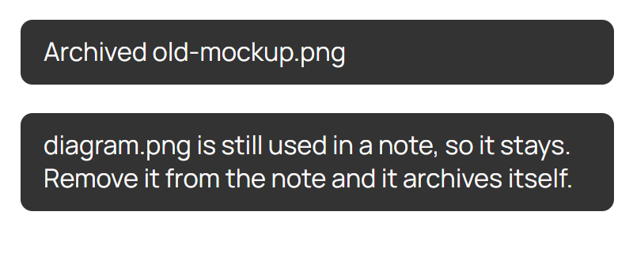
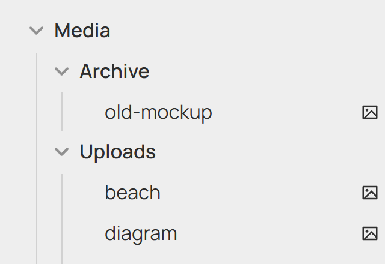

# Media Archive

An Obsidian plugin that stops media from disappearing. Deleting an image, video, audio file or PDF moves it to an archive folder (`Media/Archive` by default) instead of the trash, and only a second delete from the archive removes it for real.

It also keeps your media folder tidy on its own: files no note uses anymore are moved to the archive, and archived files that a note starts using again move back.

Kept deliberately small: two settings and no runtime dependencies besides monkey-around. [monkey-around](https://github.com/pjeby/monkey-around) is used to wrap Obsidian's delete functions safely.



## How it works

Media lives in two folders, which you can change in the settings:



| Folder | What's in it |
| --- | --- |
| **Uploads** (default `Media/Uploads`) | Media that notes are using. Point Obsidian's attachment folder here. |
| **Archive** (default `Media/Archive`) | Media that's no longer used, or that you deleted. |

### Deleting

| You delete… | What happens |
| --- | --- |
| Media anywhere outside the archive, still used by a note | Nothing. A notice says it's still in use. Remove it from the note and it archives itself. |
| Media anywhere outside the archive, not used | It moves to the archive folder. |
| Media inside the archive folder | It's deleted for real (Obsidian's normal trash behaviour). |
| Anything that isn't media | Normal Obsidian behaviour, untouched. |

This works however you delete: the file explorer, the context menu, a command or another plugin. The plugin wraps Obsidian's `vault.trash` and `vault.delete` with monkey-around, which plays well with other plugins that wrap them too and removes only its own wrapper when it's disabled.

### Automatic sorting

- An unused file in the uploads folder moves to the archive folder.
- An archived file that's used again moves back to the uploads folder.

A sort runs when Obsidian finishes loading, about 10 seconds after notes change, and every 5 minutes. A new file gets a 60-second grace period before it can be archived, so a freshly pasted image isn't archived before the note links to it.

If a file with the same name already exists in the destination, the moved file gets a number: `photo (1).png`.

### What counts as "used"

A media file is in use if any of these refer to it:

- a link or embed in a note (`![[photo.png]]`, `[](photo.png)`)
- a note's frontmatter, e.g. `cover: photo.png` or a banner property
- a file card on a canvas

Moves go through Obsidian's file manager, so links in your notes update automatically.

### Media types

Images: `png jpg jpeg gif webp svg bmp avif heic`
Video: `mp4 webm mov mkv ogv 3gp`
Audio: `mp3 wav m4a ogg flac`
Documents: `pdf`

## Settings

| Setting | Default | What it does |
| --- | --- | --- |
| Uploads folder | `Media/Uploads` | Unused files here are archived automatically, and archived files that are used again come back here. |
| Archive folder | `Media/Archive` | Deleted and unused media goes here. Deleting from it removes files for real. |

The two folders must be different, and neither can be inside the other. Changing a folder doesn't move files already in the old one. Typing in either field suggests existing folders.

## Commands

- **Media Archive: Sort media by usage now.** Runs a sort straight away and reports how many files moved.

## Install

The repo is TypeScript only, so build it first (needs Node.js):

```sh
npm install
npm run build   # type check, then bundle src/main.ts into main.js
```

1. Copy `main.js`, `manifest.json` and `styles.css` into `<vault>/.obsidian/plugins/media-archive/`.
2. Enable **Media Archive** under Settings → Community plugins.
3. Optional: pick your folders under Settings → Media Archive, and point Settings → Files and links → Default location for new attachments at the uploads folder.

## Develop

`npm run dev` rebuilds `main.js` on every save. Copy it into the vault's plugin folder and reload the plugin to try a change.

`npm run lint` runs Obsidian's official review rules ([eslint-plugin-obsidianmd](https://github.com/obsidianmd/eslint-plugin)), the same kind of checks the Community directory runs on every release.

## Releasing

1. Bump `version` in `manifest.json` (e.g. `1.0.1`) and commit.
2. Push a tag with exactly that version: `git tag 1.0.1 && git push origin 1.0.1`.
3. The **Release** workflow lints, builds and creates a draft GitHub release with `main.js`, `manifest.json` and `styles.css` attached. Check it and publish it.

## Things to know

- **Only the uploads folder is auto-archived.** Media elsewhere is archived only when you delete it.
- **Frontmatter matching is by file name.** Any frontmatter value that contains a media file's name counts as using it. If two files share a name in different folders, both count as used.
- **It changes core deletes.** Wrapping `vault.trash` and `vault.delete` is how the plugin catches every delete. It's also the part most likely to need a fix if a future Obsidian version changes those functions.
- **Desktop and mobile.** Nothing in it is desktop-only.

## License

MIT
